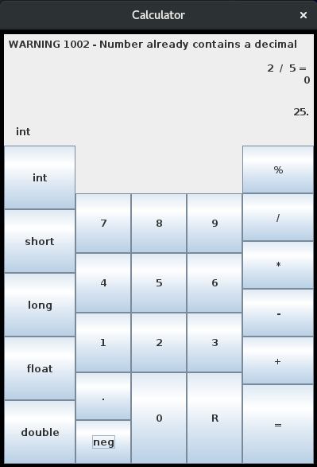

# java-Calculator
Calculator written in Java with the ability to choose the data type (int, short, long, float, double) and to do the following operations: addition, subtraction, multiplication, division, and modulus.

## Table of Contents
- Java Version
- Background
- Files
- Refactoring
- How to Use
  - calcTester
  - calcGUI
- Future Work

## Java Version
openjdk version "1.8.0_265"

## Background
**[TL;DR] : Brief explanation as to why the calculator took almost 4 years to make.**

&nbsp;&nbsp;&nbsp;&nbsp;This was originally a project I started during my winter break in 2016. I could not find a calculator that did modulus, so I decided that I would make one. I thought it would be interesting to also create a calculator that would allow the user to choose the primitive data type they wanted (int, short, long, float, or double). The original files are in the `old/` folder. During the winter break of 2016, I was able to finish most of the calculator. However, I did not finish the GUI completely as I needed to parse the numbers from the String they were stored in. Not a difficult task, but with my school work starting up again, I did not have time. Then when I was an SI in Fall 2018, the students asked me what a GUI was. I proceeded to show them this project, but I had forgotten that it did not parse the numbers yet. So over winter break in 2018, I quickly set up the parse feature, so that I had a minimal viable product, but there were still many bugs and problems that I needed to deal with still. But unfortunately I ran out of time and needed to put the project on hold again. Then in my final semester, Spring 2020, I realized that the code needed to be refactored as I did not have the best coding practices my freshman year. I decided that as soon as I graduated I would finish the project. However, once I graduated I had many other ideas of projects that I thought were more interesting which further pushed this project back. So, that is the story of why this calculator took almost 4 years to become a decent calculator.

## Files
**old/Calculator.java** - original Calculator class, not refactored
 **old/calcTester.java** - original command line tester for the Calculator, not refactored
 **old/calcGUI.java** - original GUI for the Calculator, not refactored and contains many bugs
  **new/Calculator.java** - new Calculator class, refactored
 **new/calcTester.java** - new command line tester for the Calculator, refactored
 **new/calcGUI.java** - new GUI for the Calculator, refactored and deals with many bugs

In the **(old || new)/bin/** folders are the compiled version for the respective files.

## Refactoring
**[TL;DR] : explanation of the refactoring process to change code from `old/` to `new/` version.**

&nbsp;&nbsp;&nbsp;&nbsp;When I first coded the calculator there was not much thought put in to readability or dealing with code redundancy. I simply wanted to make something that worked. However, once I returned to the code, I realized it needed a major overhaul.

&nbsp;&nbsp;&nbsp;&nbsp;The first problem I wanted to fix was turn the addition, subtraction, multiplication, division, and modulus into single functions that just returned the correct type. To do this I looked into Generics, but Generics unfortunately does not work the way I had hoped it would work. Generics uses objects which means that you cannot do addition, subtraction, multiplication, division, and modulus. So therefore it would not do what I wanted, so I then changed it to the current solution. The current solution has individual variables that store the different data types. While this is certainly not the desired way to do this, it works and is much neater than before.

&nbsp;&nbsp;&nbsp;&nbsp;The second problem I needed to fix was how many different methods printed straight to the terminal instead of returning a String that would allow the coder to decide how to display it. While this did not matter for the methods that would only be used for the terminal implementation, I still went ahead and changed it to allow for the menus to be used elsewhere if desired.

&nbsp;&nbsp;&nbsp;&nbsp;The third problem that needed to be solved was the massive methods in the GUI. Some of the methods are over 100 lines in the original code (`old/`). This is certainly a problem for readability and no one wants bloated code. I started by figuring out which code should be its own method and what it should return back to the method I needed to shrink. Some of the code was similar to other parts in the method, so I determined how to combine them into one method that I could then use in the different ways needed. This also helped solve the massive code redundancy issue which greatly shrunk the bloated code.

&nbsp;&nbsp;&nbsp;&nbsp;The fourth problem I needed to solve was how to make the code easier to follow. This was mostly simple as the other tasks had already started to fix this issue. However, there were still ways to improve. First, I renamed some variables which made it more clear as to what was happening. Then I added comments to help explain what was happening. Then I went over the method names and through the methods to see if they made sense.

&nbsp;&nbsp;&nbsp;&nbsp;The fifth problem I needed to do was fix some of the bugs that were still a problem. Many of these bugs did not cause the calculator to crash completely, but they did create long error messages on the terminal. Most of the errors could be dealt with easily with some if statements. Some of these bugs included: the user putting multiple decimal places in a number, the user pressing the equals button with nothing in the equation or not enough numbers, or divide/modulus by zero.

While dealing with these issues, I realized that I could add some features while dealing with these bugs.
 Some of these included:
- telling the user when they were doing integer division
- allowing the user to use the previous result and using it as the first number
- changing the reset button to be able to reset the current number, the equation, and the result back to empty

So overall the refactoring helped greatly, and I am sure there is still more to do, but what was refactored certainly made a difference.

## How to Use

Assuming you are using the terminal, 
- you can compile the code using: `javac <filename>.java` 
- you can run it using: `java <filename>`

If you are using something else like an IDE, you will need to load it in to the IDE and add a package if necessary to the code. However, this is up to you as I do not use IDE's to compile and execute.

The **Calculator.java** class is needed for **calcGUI.java** and **calcTester.java**, but **calcGUI.java** and **calcTester.java** do not require each other.
  

### calcTester
This one is simple as you just need to follow the prompts on the terminal. Therefore, I do not think it is necessary to explain how it works. 
*NOTE: The program will continue as long as the first character is a 'y', case does not matter.*
  

### calcGUI

 

 This one is also simple, but I will explain some of the buttons that may not be obvious:
- The "neg" button adds or removes a negative to the current number, it can be used at anytime on the current number.
- The "R" button is the reset button. It will reset the current number, then equation, then the result.
- The "%" button is the modulus button, it does not do a percentage.

The calculator defaults to using integer as the data type. You can change the data type by clicking the `int`, `short`, `long`, `float`, `double` buttons. Each button will change the text above the `int` button, this will determine what data type is being used.

In the top left corner the error and warning messages will be displayed. The image above has an example of a warning being displayed.

On the right from top to bottom, you have the equation, then the result, and the current number. See image above for clarification.

## Future Work
- [ ] use GridLayout or GridBagLayout to allow for resizing of the window.
- [ ] allow user to use keyboard to input numbers.
- [ ] allow user to press signs with numbers and not require "equal" button to be pressed to get a result.
- [ ] exponents, roots, boolean algebra, character math (ASCII)
- [ ] allow user to change colors.
